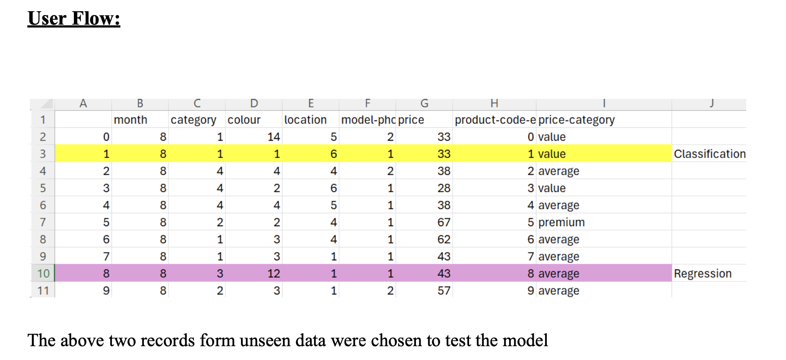

# Predictive Modeling of Clickstream Data from E-commerce source

This project focuses on analyzing clickstream data to predict potential purchasing amounts and categorize user interactions based on their potential purchases.

## Project Overview

In today's digital age, e-commerce companies strive to convert browsing users into purchasers. Understanding user interactions is crucial for optimizing offerings and tailoring product recommendations. Our goal is to explore clickstream data patterns and predict the potential purchasing amount for each user session.

## Dataset Selection and Preprocessing

### Data Source:

The dataset, sourced from the UCI repository, contains clickstream data from an online clothing store for pregnant women, spanning five months in 2008. 

The dataset includes 165,474 rows and 14 attributes.

### Data Description:

The data attributes include temporal information (year, month, day), user interactions (order, session ID), and product details (main category, clothing model, color, price).

### Data Cleaning and Preprocessing

- **Renaming Columns**: Standardized column names for consistency.
- **Encoding Categorical Variables**: Encoded categorical variables to numerical format.
- **Bucketing Price Data**: Converted the continuous price variable into categorical price categories.
- **Handling Missing Values**: Ensured no missing values were present in the dataset.

## Data Exploration and Visualization

- **Bar Charts and Histograms**: Analyzed price distribution and column value distributions.
- **Line Graphs and Count Plots**: Visualized price variations over time and user interactions.
- **Choropleth Maps**: Mapped the geographic distribution of orders and order values.

### Insights

- **Price Distribution**: Most prices are clustered around $44.
- **Monthly Activity**: April had the highest number of orders, while August had the lowest.
- **Orders by Country**: Poland, Czech Republic, and Lithuania had the highest frequency of orders.

## EDA

### Univariate Analysis

- Dropped non-informative attributes like 'year' and 'session ID'.
- Visualized the distribution of prices and monthly order activity.

### Bivariate Analysis

- **Correlation Analysis**: Used Pearson's correlation to understand attribute relationships.

## Model Building and Evaluation

### Regression Models trained:

- **Linear Regression**
- **Ridge Regression**
- **LASSO (Least Absolute Shrinkage and Selection Operator)**

### Classification Models

- **Softmax Regression**
- **K-Nearest Neighbors (KNN)**
- **Gaussian Naive Bayes**
- **Support Vector Machine (SVM)**

### Model Performance

- Neural Networks outperformed other algorithms in both regression and classification tasks.

## Model Deployment

The best-performing models were deployed leveraging AWS EC2.

### Prediction pipeline execution:

**Contributors**:

- Saurabh Sonawane 
- Bharath Raj Pragada: https://www.linkedin.com/in/bharath-raj-pragada/
- Rahul Nenavath: https://www.linkedin.com/in/rahul-nenavath/
- Ruju Shah: https://www.linkedin.com/in/rujushah0901/

